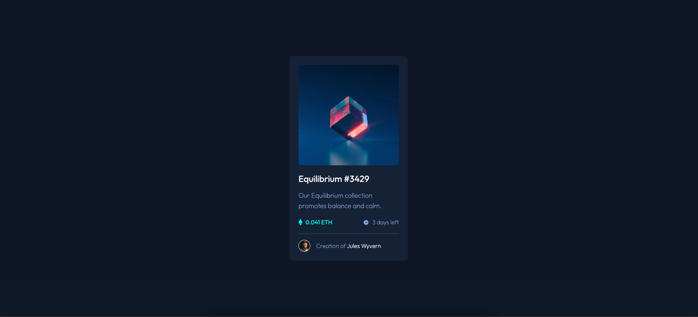

# Frontend Mentor - NFT preview card component solution

This is a solution to the [NFT preview card component challenge on Frontend Mentor](https://www.frontendmentor.io/challenges/nft-preview-card-component-SbdUL_w0U). Frontend Mentor challenges help you improve your coding skills by building realistic projects.

## Table of contents

- [Overview](#overview)
  - [The challenge](#the-challenge)
  - [Screenshot](#screenshot)
  - [Links](#links)
- [My process](#my-process)
  - [Built with](#built-with)
  - [What I learned](#what-i-learned)
  - [Continued development](#continued-development)
  - [Useful resources](#useful-resources)
- [Author](#author)

## Overview

### The challenge

Users should be able to:

- View the optimal layout depending on their device's screen size
- See hover states for interactive elements

### Screenshot

### Links

- Solution URL: [Github](https://github.com/thisisadityarao/nft-preview-card-component)
- Live Site URL: [Live site](https://nft-preview-card-component-fawn-tau.vercel.app/)

## My process

### Built with

- Semantic HTML5 markup
- CSS custom properties
- Flexbox
- CSS Grid
- Mobile-first workflow
- Tailwind CSS

### What I learned

I learned Tailwind CSS! This was the first project where I make use of Tailwind CSS. It took more time than it would have writing just plain css, but since it was my first project using tailwind, time was well utilized. I learned a lot in this single project. `:hover` states, overlay effect, using flex and grid utility classes, setting font styles and spacing using utility classes, and so much more.

### Continued development

To get the hang of tailwind, I'll be doing more challenges/projects using tailwind.

### Useful resources

- [Tailwind Documentation](https://tailwindcss.com/docs/installation) - The only resource I used to learn tailwind. Just search anything you want to know more about.

## Author

- Website - [Aditya Rao](https://adityarao.netlify.app/)
- Frontend Mentor - [@thisisadityarao](https://www.frontendmentor.io/profile/thisisadityarao)
- Twitter - [@thisisadityarao](https://www.twitter.com/thisisadityarao)
